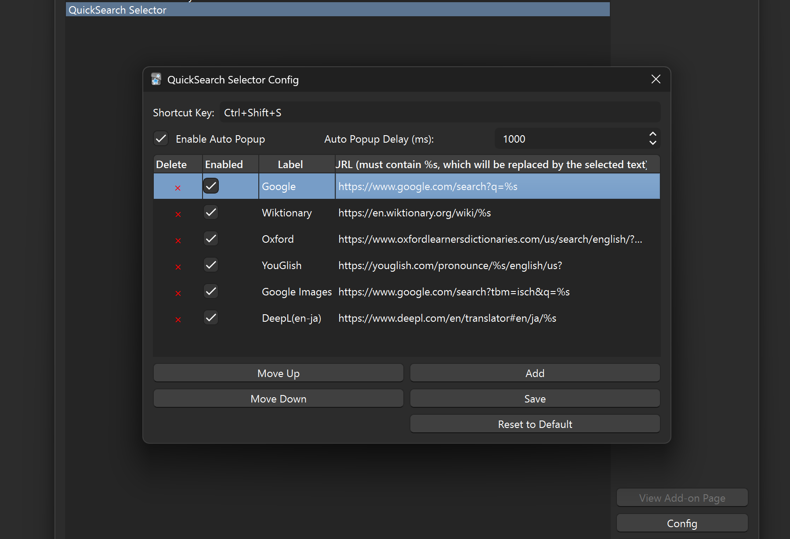

# QuickSearch Selector Add-on for Anki

This add-on allows you to quickly search selected text using predefined online tools and search engines. It also supports auto-popup functionality that triggers when text is selected.

## Features

- **Search Selected Text with Your Favorite Tools**: Select any text in Anki and search it using your preferred online tools (e.g., Google, Wiktionary, Oxford Learner's Dictionaries, YouGlish, etc.).
- **Customizable Search Tools**: Add, remove, or modify search tools in the config.
- **Shortcut Key**: Trigger the popup with a customizable shortcut key.
- **Auto-Popup**: Automatically show the popup when text is selected (configurable delay).

## Screenshots

### QuickSearch Selector in Action

### QuickSearch Selector Config

## Installation

1. Download the latest release from the [GitHub repository](https://github.com/a733573/quicksearch_selector).
2. Open Anki and go to `Tools > Add-ons > Install from File`.
3. Select the downloaded `.ankiaddon` file.

## Usage

1. **Shortcut Key**:

   - Select text in Anki.
   - Use the configured shortcut key (`Ctrl+Shift+S` by default) to open the popup.
   - Click on a search button to open the selected text in the corresponding tool.

2. **Auto-Popup**:
   - Select text in Anki.
   - After a configurable delay (default: 1000ms), the popup will automatically appear.
   - Click on a search button to open the selected text in the corresponding tool.

## Configuration

- Go to `Tools > Add-ons > QuickSearch Selector > Config` to customize settings.
- Add or remove search tools, change the shortcut key, and configure auto-popup settings.
- Supported tools include:
  - **Search Engines**: Google, Google Images
  - **Dictionaries**: Wiktionary, Oxford Learner's Dictionaries
  - **Pronunciation Tools**: YouGlish
  - **Translation Tools**: DeepL (English to Japanese)

## Troubleshooting

- If the shortcut key doesn't work, ensure it doesn't conflict with other shortcuts in Anki.
- If the auto-popup doesn't trigger, check the delay setting and ensure it's enabled.

## License

This add-on is released under the MIT License. See the `LICENSE` file for more details.
